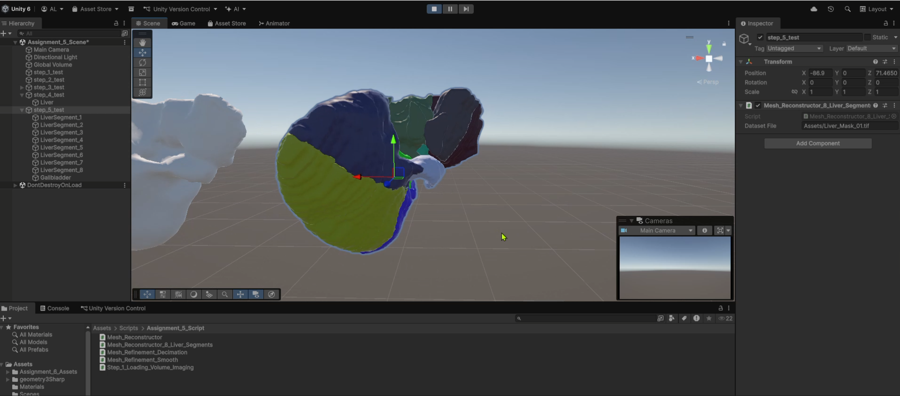
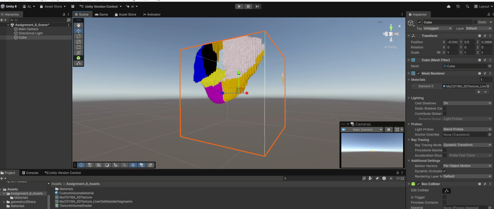
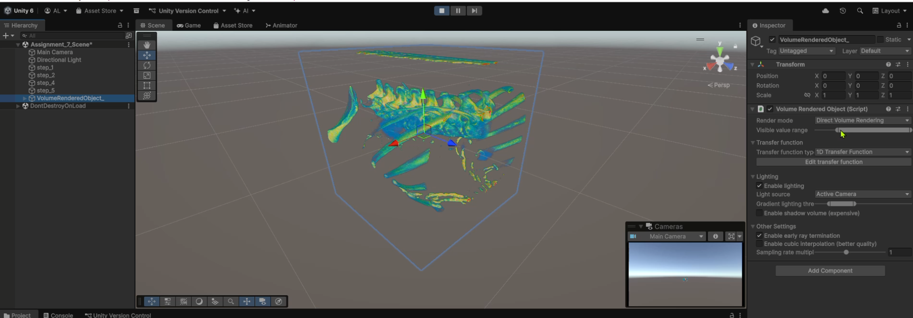

# Medical Volume Visualization Suite

A multi-project Unity/C# pipeline for medical imaging: mesh reconstruction, GPU-ready 3D texture creation, and real-time direct volume rendering.

## Projects

- Checkout demo videos in each project directory.

### Mesh Reconstruction & Segmentation
- Purpose: Generate meshes from volumetric data and label anatomical liver segments.
- Highlights: Marching-cubes style reconstruction, segment grouping, refinement passes.

- This project reconstructs organ surfaces from volumetric scans by extracting iso-surfaces and producing clean, watertight meshes suitable for downstream visualization and teaching. It focuses on the liver and partitions the model into clinically meaningful segments to support analysis, navigation, and communication. The pipeline includes smoothing and decimation to reduce polygon counts while preserving anatomical fidelity, ensuring meshes remain performant in real-time views. The steps are designed to be reproducible so volume thresholds and segment labels consistently map to the final mesh.

---

### 3D Texture Volume Builder
- Purpose: Create GPU-ready 3D textures and materials for volumetric visualization.
- Highlights: Custom shader setup, transfer functions, material configuration for liver segments.

- This project converts preprocessed medical volume data into GPU-ready Texture3D assets that Unity can sample efficiently. It normalizes intensities, optionally packs channels for color segment workflows, and prepares materials and transfer functions that highlight structures like liver segments and vasculature. The workflow standardizes asset creation so volumes can be dropped into shaders with minimal setup and consistent visual results. In short, it’s a robust bridge from raw scans to high-quality volumetric visualization.

---

### Direct Volume Rendering (DVR) Engine 
- Purpose: Real-time ray-marched DVR with transfer functions and lighting.
- Highlights: Ray casting through 3D textures, interactive parameters, Unity rendering pipeline.

- This project implements real-time direct volume rendering via ray marching through 3D textures to reveal internal anatomy without surface extraction. It provides interactive transfer functions, gradient-based lighting, and controls for sampling step size, opacity scaling, and clipping to uncover features of interest. Performance techniques like early ray termination and adjustable sampling keep interaction smooth while preserving visual fidelity. The result is an instructive, interactive view of volumetric data directly inside Unity.

---

